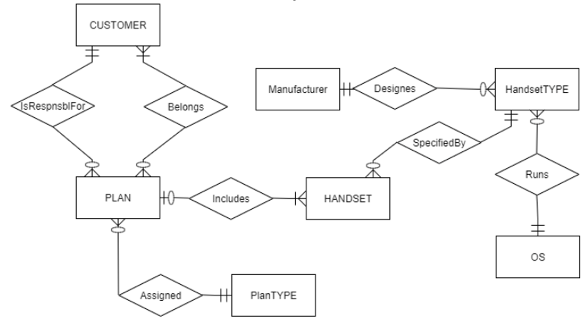

# Cellular Operator Database Questions

Look at the diagram "Cellular Operator ER diagram"

Cellular Operator Database Questions:
## a.	Can a customer have an unlimited number of plans?

Yes.  A Customer may be responsible for 0, 1, or many Plans.

## b.	Can a customer exist without a plan?
Yes.  The minimum cardinality of the Belongs relationship from the Customer to the Plan states that a Customer may exist without a Plan (the minimum cardinality is 0). 

## c.	Is it possible to create a plan without knowing who the customer is?
No.  The minimum cardinality of both the “responsible for” and “belongs” relationships between Plan and Customer states that at least one Customer must be related to a Plan.

## d.	Does the operator want to limit the types of handsets that can be linked to a specific plan type?

Yes, the cellular operator requires that a Handset (that is a particular type and a particular operating system) is linked to one Plan (that is a particular type of plan).  This business rule is to be implemented in this design by indirectly requiring that a Plan Type has 0:M Plans, and each Plan is associated with certain Handsets, and each Handset is of some Handset Type.  A given Plan Type is related to Handset Type through the intermediary entity types in this design.

_Alternative interpretation:  No, there is nothing in the current model that creates a condition that would limit – in advance – the handset types that can be related to a specific plan type._

## e.	Is it possible to maintain data regarding a handset without connecting it to a plan? 

Yes.  The minimum cardinality of the Includes relationship between Plan and Handset states that a Handset may be included in 0 or 1 plan.  The 0 minimum cardinality means that we can track data about the handset even if it is not connected to a plan; the Handset has optional participation in the Includes relationship with Plan.

## f.	Can a handset be associated with multiple plans?

No.  The minimum cardinality of the Includes relationship between Plan and Handset states that a Handset may be included in 0 or 1 plan, not multiple plans.

## g.	Assume a handset type exists that can utilize multiple operating systems. Could this situation be accommodated within the model included in Figure 2-24?

No.  The current model shows that a handset type is associated with one and only one operating system.

## h.	Is the company able to track a manufacturer without maintaining information about its handsets?

Yes.  The minimum cardinality of the relationship between Manufacturer and Handset Type indicates that we can track data about a Manufacturer even if we have no (or zero) Handset Types in our database.

## i.	Can the same operating system be used on multiple handset types?

Yes.  The maximum cardinality on the relationship between Operating System and Handset Type indicates that an Operating System may be used on 0, 1, or many Handset types.

## j.	There are two relationships between Customer and Plan. Explain how they differ.

The Responsible For relationship is an overall 1:M relationship between Customer and Plan.  A Customer can be responsible for 0, 1, or many Plans yet any one Plan will be linked to only 1 Customer for responsibility purposes.  The Belongs relationship is an overall M:M relationship that permits the linking of multiple customers to a single plan, as in the case of family members being part of a particular plan or different plans.

## k.	Characterize the degree and the cardinalities of the relationship that connects Customer to itself. Explain its meaning.

The “Family Member” relationship that connects Customer to itself has a degree of 1 (unary).  It permits the tracking of each family member as a Customer.  Any Customer may be a Family Member of 0, 1, or many Customer(s); as a Family Member Customer, the Customer may be linked to 0 or 1 Customer.

## l.	Is it possible to link a handset to a specific customer in a plan with multiple customers?
No, this is not possible according to the current model.  However, the current model could be adjusted to create an Associative Entity to track the particular Customer instance with a particular Plan instance, that is then associated with a particular Handset.  This suggested extension to the current model also permits a design that will easily extend the database’s ability to track additional data about the particular Customer instance with a particular Plan instance.

## m.	Can the company track a handset without identifying its operating system?
No. The minimum cardinality of the relationship between Handset Type and Operating System is 1 and only 1; the minimum of 1 is a mandatory participation for the Handset Type with the Operating System.

