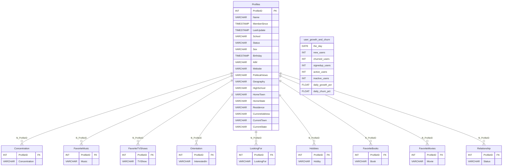

# Facebook Database Schema

```mermaid
erDiagram
    Concentration {
        INT ProfileID FK
        VARCHAR Concentration
    }

    FavoriteBooks {
        INT ProfileID FK
        VARCHAR Book
    }

    FavoriteMovies {
        INT ProfileID FK
        VARCHAR Movie
    }

    FavoriteMusic {
        INT ProfileID FK
        VARCHAR Music
    }

    FavoriteTVShows {
        INT ProfileID FK
        VARCHAR TVShow
    }

    Hobbies {
        INT ProfileID FK
        VARCHAR Hobby
    }

    LookingFor {
        INT ProfileID FK
        VARCHAR LookingFor
    }

    Orientation {
        INT ProfileID FK
        VARCHAR InterestedIn
    }

    Profiles {
        INT ProfileID PK
        VARCHAR Name
        TIMESTAMP MemberSince
        TIMESTAMP LastUpdate
        VARCHAR School
        VARCHAR Status
        VARCHAR Sex
        TIMESTAMP Birthday
        VARCHAR AIM
        VARCHAR Website
        VARCHAR PoliticalViews
        VARCHAR Geography
        VARCHAR HighSchool
        VARCHAR HomeTown
        VARCHAR HomeState
        VARCHAR Residence
        VARCHAR CurrentAddress
        VARCHAR CurrentTown
        VARCHAR CurrentState
    }

    Relationship {
        INT ProfileID FK
        VARCHAR Status
    }

    user_growth_and_churn {
        DATE the_day
        INT new_users
        INT churned_users
        INT signedup_users
        INT active_users
        INT inactive_users
        FLOAT daily_growth_pct
        FLOAT daily_churn_pct
    }

    Profiles ||--o{ Concentration : "fk_ProfileID"
    Profiles ||--o{ FavoriteMusic : "fk_ProfileID"
    Profiles ||--o{ FavoriteTVShows : "fk_ProfileID"
    Profiles ||--o{ Orientation : "fk_ProfileID"
    Profiles ||--o{ LookingFor : "fk_ProfileID"
    Profiles ||--o{ Hobbies : "fk_ProfileID"
    Profiles ||--o{ FavoriteBooks : "fk_ProfileID"
    Profiles ||--o{ FavoriteMovies : "fk_ProfileID"
    Profiles ||--o{ Relationship : "fk_ProfileID"
```
