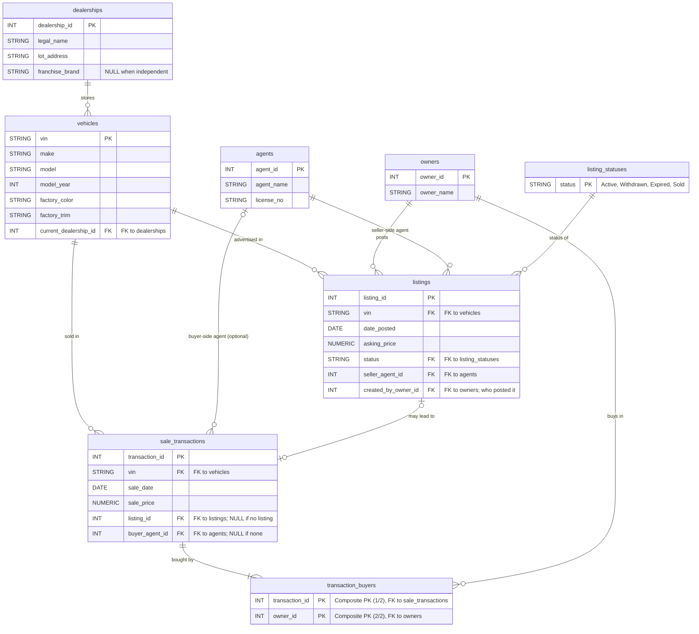

# CarConnect Teaching Database Schema

BigQuery dataset: `nyu-datasets.carconnect_teaching`

This is the implemented version of the **CarConnect** business scenario used
in Assignment 1a (ER diagrams and relational schemas). Students design the
schema in Module 1 and then query this implementation in Module 2 onward.
The data is small (fewer than a dozen rows per table) and fully fictional, so
queries can be checked by hand.

## Notes for reading the schema

- **Ownership is inferred, not stored.** There is no "current owner" column.
  The buyers of the most recent `sale_transactions` row for a VIN are the
  current owners; the buyers of the sale before that were the sellers. Joint
  purchases appear as multiple `transaction_buyers` rows for one transaction.
- **Listings and sales are optional in both directions.** A listing may never
  lead to a sale (`Expired`, `Withdrawn`, or still `Active`), and a sale may
  have no listing (`sale_transactions.listing_id IS NULL`), e.g. a private
  sale or an initial dealer sale.
- **Two agent roles, one table.** `listings.seller_agent_id` is required (every
  listing has exactly one seller-side agent). `sale_transactions.buyer_agent_id`
  is optional and often NULL.
- **Status values** are documented by the `listing_statuses` lookup table, so
  `SELECT * FROM listing_statuses` lists the valid values. The foreign key
  from `listings.status` to it is declared but, like all BigQuery key
  constraints, not enforced: BigQuery would accept a listing with a status
  outside the lookup table. The lookup records the valid domain; enforcing it
  would be the job of whatever loads the data.
- **Differences from the Assignment 1a spec** worth pointing out to students:
  `transaction_buyers` is the bridge table that implements "multiple buyers
  may purchase jointly"; `listings.created_by_owner_id` is an explicit
  extension recording who posted the listing; `vehicles.current_dealership_id`
  stores only the *current* lot, so lot history is not recoverable.

## Size

Every table holds fewer than a dozen rows, so any query result can be checked
by hand. Exact row counts are answer-side material and live in the private
answers repo (see `CLAUDE.md`).
