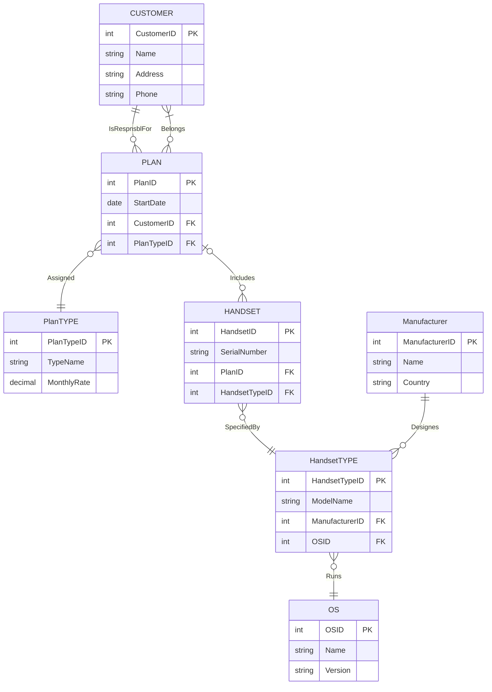
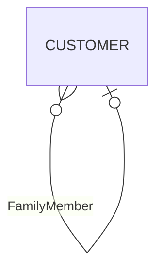

# Cellular Operator ER Diagram

## Cardinality Reference

| Symbol | Meaning |
|--------|---------|
| `\|\|` | Exactly one |
| `o\|` | Zero or one |
| `\|{` | One or more |
| `o{` | Zero or more |

## Relationship Summary

| Relationship | From | To | Cardinality | Description |
|--------------|------|-----|-------------|-------------|
| IsRespnsblFor | CUSTOMER | PLAN | 1:M | One customer is responsible for many plans |
| Belongs | CUSTOMER | PLAN | M:N | Many customers can belong to many plans |
| Assigned | PLAN | PlanTYPE | M:1 | Many plans assigned to one plan type |
| Includes | PLAN | HANDSET | 1:M (optional) | One plan includes many handsets (both optional) |
| SpecifiedBy | HANDSET | HandsetTYPE | M:1 | Many handsets specified by one handset type |
| Designes | Manufacturer | HandsetTYPE | 1:M | One manufacturer designs many handset types |
| Runs | HandsetTYPE | OS | M:1 | Many handset types run one OS |

## Note

The original Figure 2-24 from the textbook may include a **unary (self-referential) relationship** on CUSTOMER called "Family Member" which is not shown in the provided image. That relationship would be:

This allows tracking family relationships between customers (0:M on one side, 0:1 on the other).
