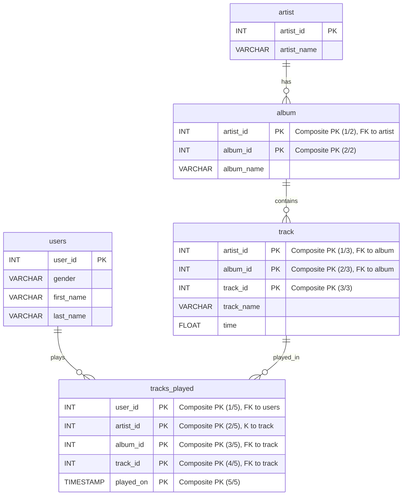

# Music Database Schema

```mermaid
erDiagram
    artist {
        INT artist_id PK
        VARCHAR artist_name
    }
    album {
        INT artist_id PK "Composite PK (1/2), FK to artist"
        INT album_id PK "Composite PK (2/2)"
        VARCHAR album_name
    }
    track {
        INT artist_id PK "Composite PK (1/3), FK to album"
        INT album_id PK "Composite PK (2/3), FK to album"
        INT track_id PK "Composite PK (3/3)"
        VARCHAR track_name
        FLOAT time
    }
    users {
        INT user_id PK
        VARCHAR gender
        VARCHAR first_name
        VARCHAR last_name
    }
    tracks_played {
        INT user_id PK "Composite PK (1/5), FK to users"
        INT artist_id PK "Composite PK (2/5), K to track"
        INT album_id PK "Composite PK (3/5), FK to track"
        INT track_id PK "Composite PK (4/5), FK to track"
        TIMESTAMP played_on PK "Composite PK (5/5)"
    }

    artist ||--o{ album : "has"
    album ||--o{ track : "contains"
    users ||--o{ tracks_played : "plays"
    track ||--o{ tracks_played : "played_in"
```
