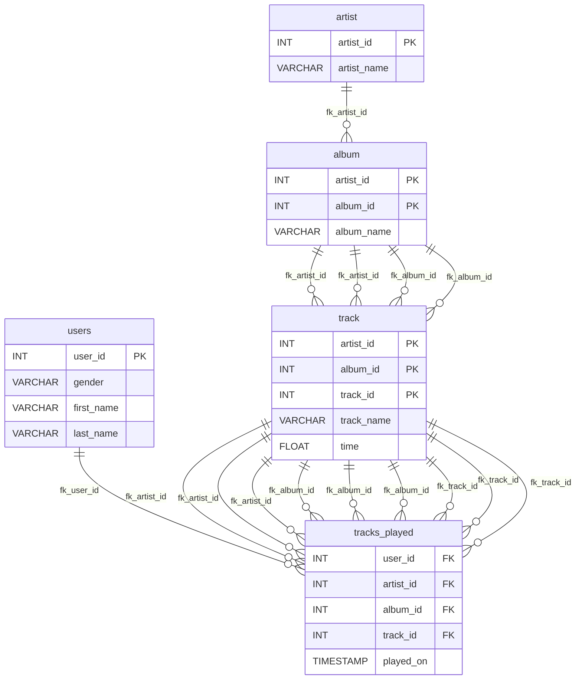

# Music Database Schema

```mermaid
erDiagram
    album {
        INT artist_id PK
        INT album_id PK
        VARCHAR album_name
    }

    artist {
        INT artist_id PK
        VARCHAR artist_name
    }

    track {
        INT artist_id PK
        INT album_id PK
        INT track_id PK
        VARCHAR track_name
        FLOAT time
    }

    tracks_played {
        INT user_id FK
        INT artist_id FK
        INT album_id FK
        INT track_id FK
        TIMESTAMP played_on
    }

    users {
        INT user_id PK
        VARCHAR gender
        VARCHAR first_name
        VARCHAR last_name
    }

    album ||--o{ track : "fk_artist_id"
    album ||--o{ track : "fk_artist_id"
    album ||--o{ track : "fk_album_id"
    album ||--o{ track : "fk_album_id"
    artist ||--o{ album : "fk_artist_id"
    users ||--o{ tracks_played : "fk_user_id"
    track ||--o{ tracks_played : "fk_artist_id"
    track ||--o{ tracks_played : "fk_artist_id"
    track ||--o{ tracks_played : "fk_artist_id"
    track ||--o{ tracks_played : "fk_album_id"
    track ||--o{ tracks_played : "fk_album_id"
    track ||--o{ tracks_played : "fk_album_id"
    track ||--o{ tracks_played : "fk_track_id"
    track ||--o{ tracks_played : "fk_track_id"
    track ||--o{ tracks_played : "fk_track_id"
```
